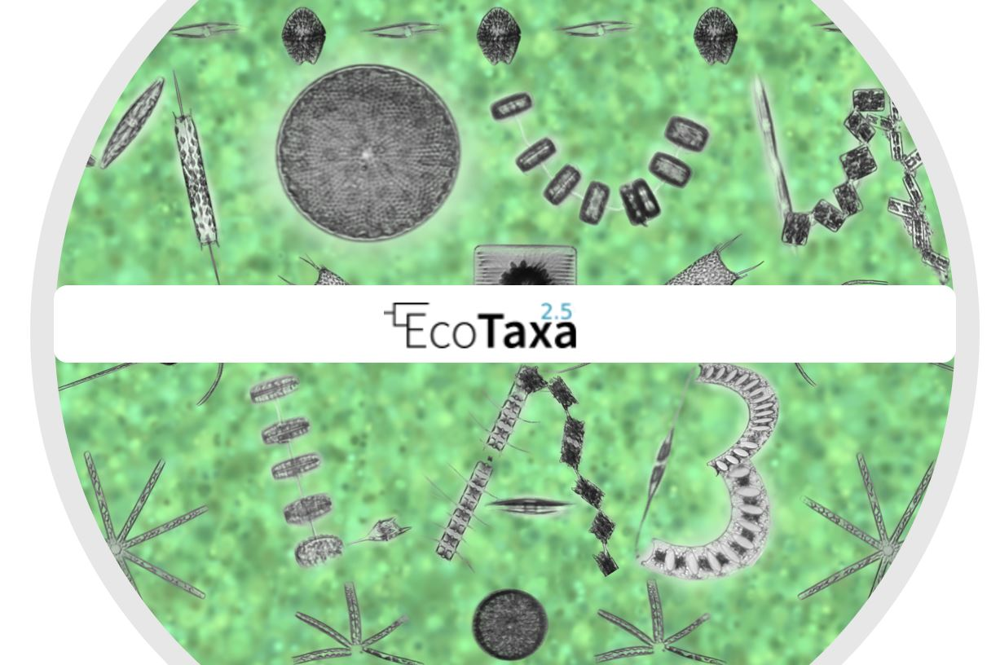
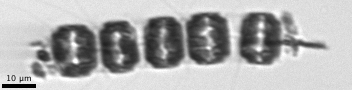

<!-- README.md is generated from README.Rmd. -->

# IFCB data formatting for EcoTaxa 

<!-- badges: start -->

[](https://opensource.org/licenses/MIT)
[](https://www.r-project.org/)
[](https://www.mathworks.com/products/matlab.html)

<!-- badges: end -->

This repository shows how to easily format IFCB data that are stored in
a database, with or without manual annotation, into a format suitable to
be imported in EcoTaxa.

This is especially useful to:

1.  Import in EcoTaxa images that were manually annotated with another
    tool such as ifcb-annotate (either for validation or to use as
    training set for non annotated images)
2.  Export non-annotated images to classify them in EcoTaxa

## EcoTaxa format

EcoTaxa imports and exports metadata of images with specific column
names. The importation requires:

1.  a zip file of all the images you want to import
2.  a tsv file with the metadata associated (including the
    classification)

<p align="center">

</p>

In the file each row corresponds to one image, the headers being
standardized categories for EcoTaxa and the second row indicating the
type of each column (float or text). The columns for the image above
would look like that:


Note that the actual EcoTaxa headers are longer and preceded by
“object\_”, “object\_annotation” or “acq\_”. They can be found in the
example file *data/ecotaxa\_example\_1image.tsv*.

## IFCB format

The default data processing for the IFBC images extracts the blobs
(.png) and the features (.csv) for each sample and stores the images in
MATLAB .mat files. These data can be stored in a database in order to be
readily and easily accessible. Every database is different so the sql
queries will have to be adapted.

For reference, the database designed by Audrey Ciochetto for the Mouw
lab look like that: the main tables needed for the export to EcoTaxa are
the *raw\_files* table with all the samples metadata which connects to
the *roi table* with every image, the *class* table records all the
classes used and their equivalence in other systems and the
*manual\_class* the manually annotated images with their annotation.


## Installation

You can either clone this repository or download the scripts that are of
interest for you.

``` bash
git clone https://github.com/VirginieSonnet/IFCBdatabaseToEcotaxa.git
```

## Pre-requisites

Make sure that you have the MATLAB code
***export\_png\_from\_ROIlist.m*** developed by Heidi Sosik. If you have
the ifcb-analysis package, it is included in it, in IFCB\_tools.

If you have a database you most probably have queried within MATLAB but
if not, make sure that the correct driver corresponding to your database
and exploitation system is installed (e.g.: **JDBC driver** for mysql,
<https://www.mathworks.com/help/database/ug/mysql-jdbc-windows.html>).

For the codes below to run, make sure that your preference for database
format is *structure* and not *cell array*.

``` matlab
setdbprefs('DataReturnFormat','structure')
```

## Extract the PNG images (MATLAB)

1.  **Database connection access**: the MATLAB function *db\_connect*
    created by Audrey Ciochetto assumes a JDBC driver (change line 22 if
    not the case for you). When opening your connection, update the
    arguments with your database name, server name, user name and
    password.

    ``` matlab
    DBC = db_connect(db='ifcb_mouw2',server='phytoplankton.upmc.edu',user='virginie', pswd='Restmonami')
    ```

2.  The MATLAB function *db\_make\_or\_clause.m* created by Audrey
    Ciochetto writes text strings for MySQL “OR” statements (you should
    have no changes to make)

3.  The MATLAB functio *ifcb\_extract\_images.m* created by Audrey
    Ciochetto is a wrapper function around the
    *export\_png\_from\_ROIlist.m* function developed by Heidi Sosik. It
    adapts the code to a database design (you should have no changes to
    make)

4.  The MATLAB script ***ifcb\_extract\_manual\_images.m*** created by
    Audrey Ciochetto calls the previous functions to extract the images.
    You will have to adapt the queries to the design of your database.  
    In the first part of the code, you can either: query the ids of all
    manually classified or of a specific class.  
    In the second part of the code, you can choose to extract all images
    to the same folder, to a separate folder for each species or only to
    extract the images of the chosen class from the previous part.

## Create the EcoTaxa metadata file

1.  Query the information needed from the database
2.  Create, rename and reorder the columns to match the EcoTaxa column
    names

## Import in EcoTaxa

Create a zip file containing both your extracted images and the metadata
file.

If the file is small enough (&lt; 100MB) you can import it directly in
EcoTaxa selecting *Project &gt; Import images and metadata &gt; Upload
folder(s) compressed as a zip file* within your project environment.

If your file is bigger, upload your data on their server in the folder
corresponding to your group and, within your project, import it via
*Project &gt; Import images and metadata &gt;* *Choose a folder or zip
file on the server*.Don’t forget to erase your file from the server once
imported!

<ins>
Credit
</ins>

: composite image created by Rowan Cirivello.
